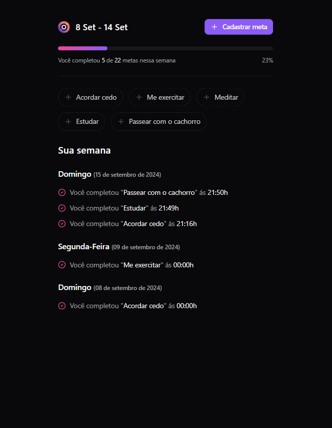
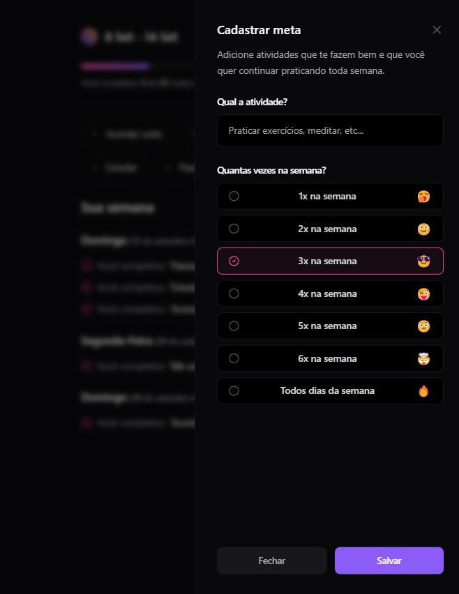

# in.orbit Web



Essa aplicação foi desenvolvida durante o evento NLW da Rocketseat.
É uma aplicação contruida com React para gerenciar metas e completa-las

## Executando

Após clonar o repositório, acesse a pasta do projeto e execute os comandos abaixo:

```sh
npm install
npm run dev

```

Acesse <http://localhost:5173> para visualizar a aplicação.

## Tech Stack
- React
- react-hook-form
- tailwind
- zod
- dayjs
- @tanstack/react-query
- lucide-react
- shadcn

## Screenshots

<p>
  
</p>
